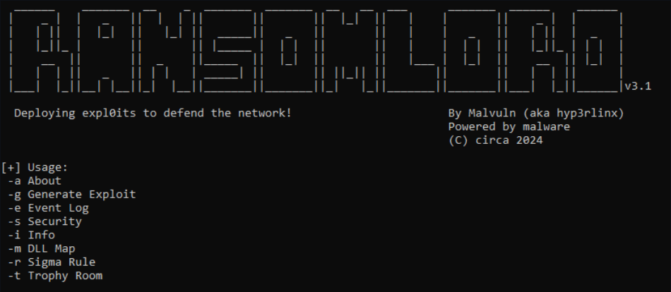

# RansomLord

<p align="center">
  
</p>

ReadMe : [Francais](https://github.com/ArtemissFR/ODIN_Project/blob/main/RansomLord/Documentation/README_FR.md) | [English](https://github.com/ArtemissFR/ODIN_Project/blob/main/RansomLord/README.md)

RansomLord est un outil de preuve de concept anti-ransomware qui génère des fichiers PE, utilisé pour exploiter les ransomwares vulnérables avant le chiffrement.

- **Langue** : C
- **SHA256** : 647494bda466e645768d6f7d1cd051097aee319f88018d1a80547d8d538c98db

## Fonctionnalités

Cette version intercepte et termine désormais les malwares testés à partir de 49 groupes de menaces différents, y compris :
- StopCrypt
- RisePro
- RuRansom
- MoneyMessage
- CryptoFortress
- Onyx

### Mise à jour des fonctionnalités

- Le journal IOC des événements Windows inclut désormais le hash SHA256 ainsi que le chemin complet du malware intercepté.
- Ajout du flag `-r` pour générer une règle Sigma pour détecter l'activité de RansomLord à l'aide du journal des événements Windows.

### Note importante

**TÉLÉCHARGEZ le fichier EXE "RansomLord_v3.1.exe" et NON l'archive .ZIP "Source code(zip)" car elle contient des versions plus anciennes.**

### Note de sécurité

Les moteurs de sécurité de mauvaise qualité peuvent incorrectement signaler les DLLs de RansomLord comme malveillantes. Elles ne le sont PAS ! Elles exportent des stubs de fonctions Win32 API, fournissent des fonctionnalités pour générer des journaux d'événements IOC Windows et appellent finalement `exit()`.

#### Hashs MD5 des DLLs générées :
- **x32** : 37b9ebad522e0744aa8daa0bf5b2a58b
- **x64** : 7807454015bb44161ccf593e2fe5334b

## Références

- [Conti, REvil, LockBit Ransomware Bugs Exploited to Block Encryption](https://web.archive.org/web/20220601204439/https://www.bleepingcomputer.com/news/security/conti-revil-lockbit-ransomware-bugs-exploited-to-block-encryption/)
- [Vulnerabilities Allow Hijacking Most Ransomware to Prevent File Encryption](https://web.archive.org/web/20220504180432/https://www.securityweek.com/vulnerabilities-allow-hijacking-most-ransomware-prevent-file-encryption/)

## Source officielle sur GitHub
- [RansomLord v3.1 par malvuln](https://github.com/malvuln/RansomLord/releases/tag/v3)

<p align="center">
  
</p>

---

## Script PowerShell

Ce script automatise le téléchargement et l'exécution de RansomLord_v3.1.exe.

### Objectif

1. **Télécharger** le fichier RansomLord_v3.1.exe dans `C:\RansomLord\`.
2. **Créer le répertoire** `C:\RansomLord` s'il n'existe pas.
3. **Exécuter le fichier téléchargé** avec le flag `-g`.
4. **Envoyer une touche Entrée** si nécessaire.

### Script

```powershell
# Définir l'URL de téléchargement et le chemin de destination du fichier
$url = "https://github.com/malvuln/RansomLord/releases/download/v3/RansomLord_v3.1.exe"
$destinationPath = "C:\RansomLord\RansomLord_v3.1.exe"

# Créer le répertoire s'il n'existe pas
if (-Not (Test-Path "C:\RansomLord")) {
    New-Item -ItemType Directory -Path "C:\RansomLord"
}

# Télécharger le fichier
Invoke-WebRequest -Uri $url -OutFile $destinationPath

# Changer de répertoire
Set-Location "C:\RansomLord"

# Exécuter le fichier avec les paramètres
Start-Process -FilePath ".\RansomLord_v3.1.exe" -ArgumentList "-g" -Wait

# Si une touche Entrée est nécessaire, l'envoyer
Start-Sleep -Seconds 2
[System.Windows.Forms.SendKeys]::SendWait("{ENTER}")
