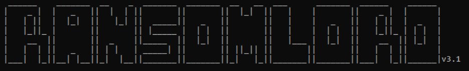
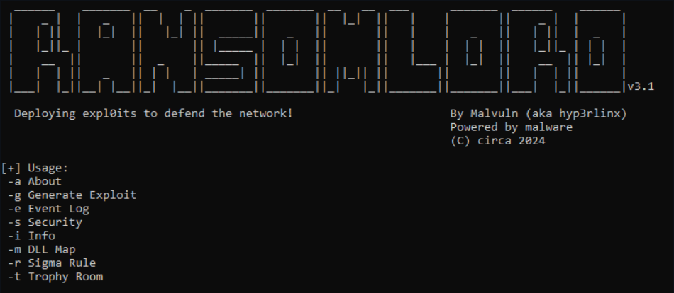

# RansomLord

<p align="center">
  
</p>

ReadMe : [Francais](https://github.com/ArtemissFR/ODIN_Project/blob/main/RansomLord/Documentation/README_FR.md) | [English](https://github.com/ArtemissFR/ODIN_Project/blob/main/RansomLord/README.md)

RansomLord is a proof-of-concept Anti-Ransomware exploitation tool that generates PE files, used to exploit vulnerable ransomware pre-encryption.

- **Lang**: C
- **SHA256**: 647494bda466e645768d6f7d1cd051097aee319f88018d1a80547d8d538c98db

## Features

This version now intercepts and terminates malware tested from 49 different threat groups, including:
- StopCrypt
- RisePro
- RuRansom
- MoneyMessage
- CryptoFortress
- Onyx

### Feature Update

- Windows event IOC log now includes the SHA256 hash plus full path of the intercepted malware.
- Added `-r` flag to output a Sigma rule for detecting RansomLord activity using Windows event log.

### Important Note

**DOWNLOAD "RansomLord_v3.1.exe" EXE file and NOT the "Source code(zip)" .ZIP archive as that contains older versions.**

### Security Note

Lamer security engines may incorrectly flag RansomLord DLLs as malicious. They are NOT! They export Win32 API function stubs, provide functionality to generate Windows IOC event logs, and eventually call `exit()`.

#### Generated Exploit DLL MD5 File Hashes:
- **x32**: 37b9ebad522e0744aa8daa0bf5b2a58b
- **x64**: 7807454015bb44161ccf593e2fe5334b

## References

- [Conti, REvil, LockBit Ransomware Bugs Exploited to Block Encryption](https://web.archive.org/web/20220601204439/https://www.bleepingcomputer.com/news/security/conti-revil-lockbit-ransomware-bugs-exploited-to-block-encryption/)
- [Vulnerabilities Allow Hijacking Most Ransomware to Prevent File Encryption](https://web.archive.org/web/20220504180432/https://www.securityweek.com/vulnerabilities-allow-hijacking-most-ransomware-prevent-file-encryption/)

## Official github source
- [RansomLord v3.1 by malvuln](https://github.com/malvuln/RansomLord/releases/tag/v3)

<p align="center">
  
</p>

---

## PowerShell Script

This script automates the download and execution of RansomLord_v3.1.exe.

### Purpose

1. **Download** the RansomLord_v3.1.exe file to `C:\ODIN\RansomLord\`.
2. **Create the directory** `C:\ODIN\RansomLord` if it does not exist.
3. **Execute the downloaded file** with the `-g` flag.
4. **Send an Enter keystroke** if necessary.

### Script

```powershell
# Define the download URL and the file location
$url = "https://github.com/malvuln/RansomLord/releases/download/v3/RansomLord_v3.1.exe"
$destinationPath = "C:\ODIN\RansomLord\RansomLord_v3.1.exe"

# Create the folder if it doesn't exist
if (-Not (Test-Path "C:\ODIN")) {
    New-Item -ItemType Directory -Path "C:\ODIN"
}

# Create the folder if it doesn't exist
if (-Not (Test-Path "C:\ODIN\RansomLord")) {
    New-Item -ItemType Directory -Path "C:\ODIN\RansomLord"
}

# Download the file
Invoke-WebRequest -Uri $url -OutFile $destinationPath

# Change directory
Set-Location "C:\ODIN\RansomLord"

# Execute the file with parameters
Start-Process -FilePath ".\RansomLord_v3.1.exe" -ArgumentList "-g" -Wait

# If input is needed, send an "Enter" key
Start-Sleep -Seconds 2
[System.Windows.Forms.SendKeys]::SendWait("{ENTER}")

